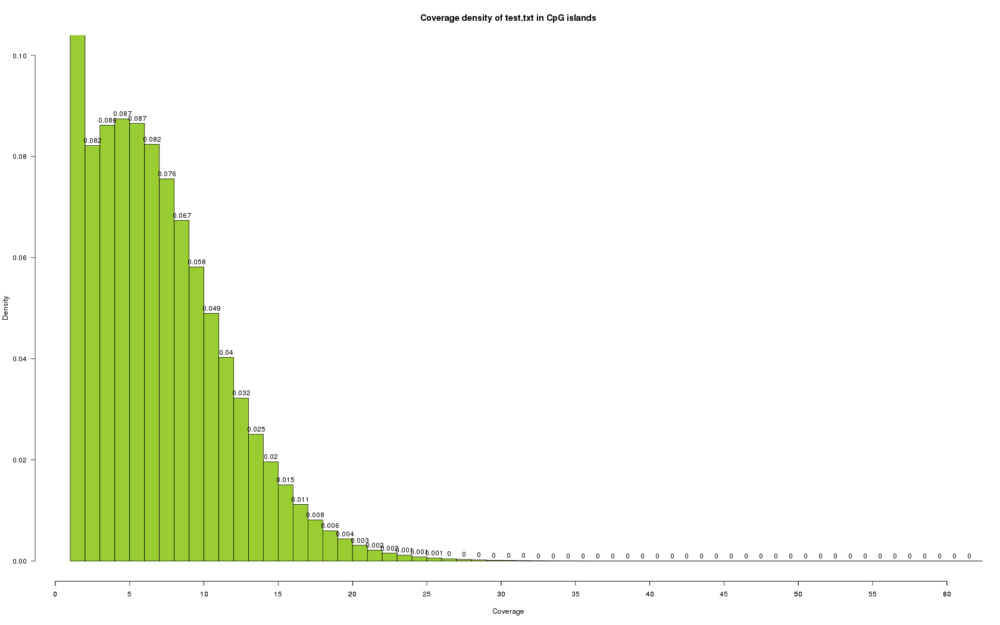

# Tools
I thought maybe I should commit some of my more useful tools to git for easier future access (and the good of my fellow man?)

#### NGS pipeline
In the NGS_pipeline folder is a NGS pipeline for DNA data that I created in bpipe.

#### remove_unpaired.py
For the special case of having a SAM/BAM file with a mix of paired-end and single-end reads where the single-end reads dont have the correct flags for easy SAMTOOLS removal. The script separates the PE- and SE reads into two files.

#### subset.fastq.sh
Grab the first nr of lines from a fastq.gz file so you can dryrun your pipeline/tool/method on this subset of data.

#### Create_Cosmic.sh
Create a COSMIC file from any version of their database such as exists in the GATK resource files. Useful for example when using MuTect.

#### mergeConvertCpGReport.r
Merge Single-end and Paired-end aligned bismark_methylation_extractor Cytosine reports. (*.CpG_report.txt). Optional conversion to [methylKit](https://github.com/al2na/methylKit) input format.
Useful for when you had a low mapping efficiency and want as much aligned content as possible.

#### CpG_report2methylKit.r
Convert a single CpG report (cytosine report) to methylKit input format.

#### Coverage_in_regions_histogram.r
Produce a coverage histogram in any regions. For example CpG island regions.

Usage: `Rscript Coverage_in_regions_histogram.r input.txt Hsapien_CpG_islands_hg19.txt`

The region file should be tab separated file with columns chromosome, start, end.
Example:
```
chr     start   end
chr1    84934572        84935054
chr1    63176547        63177427
chr1    125435174       125435976
```

The CpG island regions for Hsapien and Mmusculus can be downloaded from this repository.
The input file should be tab separated file with columns chromosome, position, coverage.
Example:
```
chr1    3000827 8
chr1    3001007 5
chr1    3001008 3
```

Output is a density histogram of coverage.

